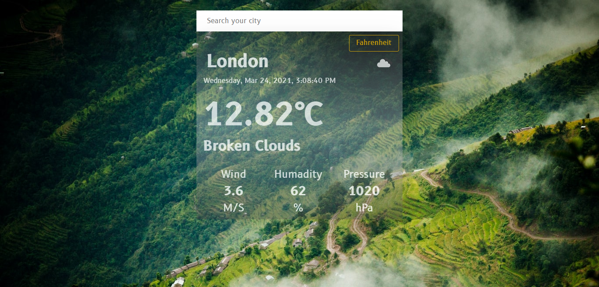

# Weather App

> 
> 
> The Weather App project comes at the end of the Asynchronous Javascript and APIs section of the Javascript course in Microverse. It tests the knowledge of the student about asynchronous communication with promises or async/await and when to use them.

> [You can find the original project specification at:](https://www.theodinproject.com/courses/javascript/lessons/weather-app)

## Live Demo

-[live-version](https://uzbek-kitchen.netlify.app/)

## Getting Started

- Clone the repo `git@github.com:Murodjon000/restaurant-js.git`
- cd `into` the project
- Run `git pull origin project`
- On the terminal open up the live server, while in the 'Restaraunt' directory:

## Author

👤 **Murodjon Tursunpulatov**

- Github: [@murodjon000](https://github.com/murodjon000)
- Twitter: [@MurodjonTursun5](https://twitter.com/MurodjonTursun5)
- Linkedin: [@Murodjon Tursunpulatov](https://www.linkedin.com/in/murodjon-tursunpulatov-5189481b3/)

## 🤝 Contributing

Contributions, issues and feature requests are welcome!

Feel free to check the [issues page](issues/).

## Show your support

Give a ⭐️ if you like this project!

## 📝 License

MIT License
